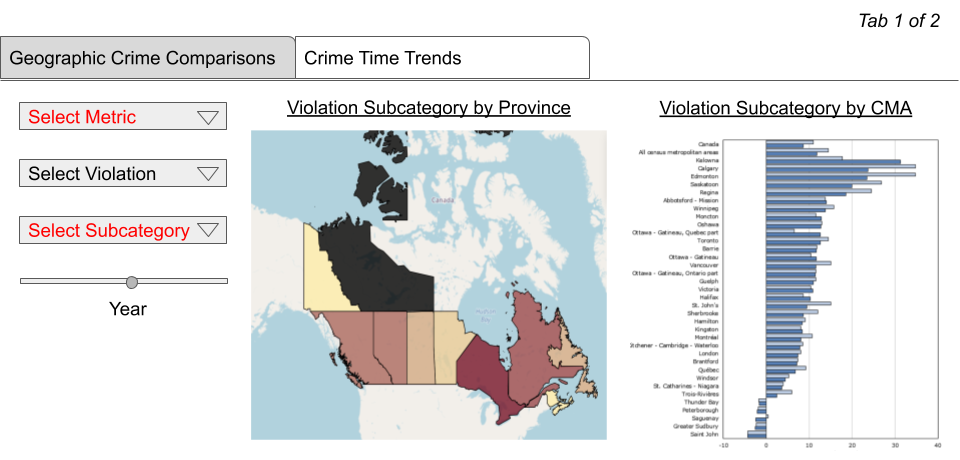
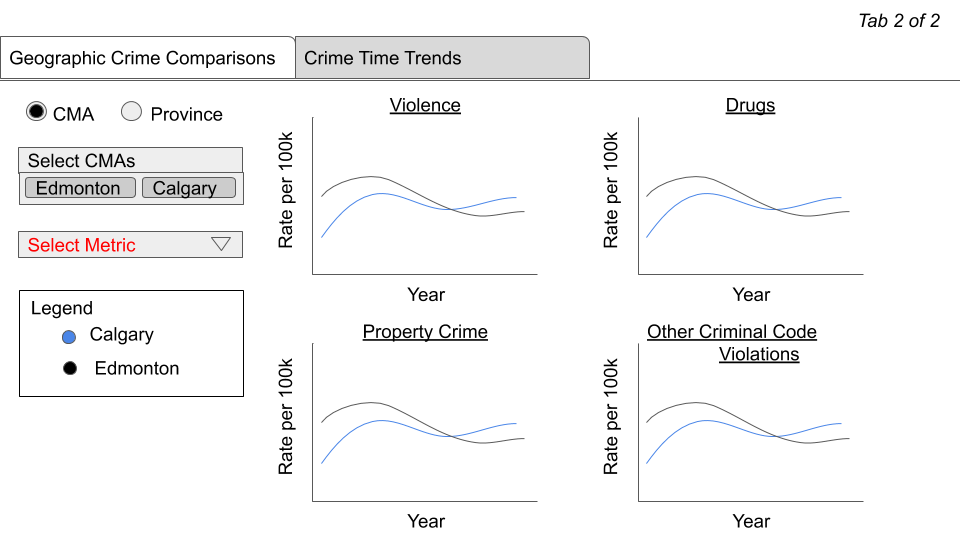

# DSCI 532 - Group 22

The project housed in this repository has been created in partial fulfillment of the requirements of DSCI 532: Visualization II of the University of British Columbia's Master of Data Science program (2020/2021).  The purpose of this project is to create an interactive dashboard that allows users to explore and interact with a data set.  [Click here](https://github.com/UBC-MDS/532_Group_22/blob/main/proposal.md) to view our proposal for *Criminality in Canada: Fighting Anecdotes with Data*. 

For our Milestone 2 release, our Dashboard can be found here: https://canadian-crime.herokuapp.com/

The data source is [Incident-based crime statistics, by detailed violations, Canada, provinces, territories and Census Metropolitan Areas](https://www150.statcan.gc.ca/t1/tbl1/en/cv.action?pid=3510017701) released by Statistics Canada.

## Welcome

Hi everyone, thanks for visiting the Criminality in Canada: Fighting Anecdotes with Data app project repository. 

The document you are currently reading (README) is here to provide an overview and give some information regarding our project. Click the links below to take you to a section in which you're interested, or just scroll down to find out more. 

* [`What are we doing? (And why?)`](#What-are-we-doing-And-why?)
* [`Who are we?`](#Who-are-we?)
* [`Installation`](#Installation)
* [`Team Members`](#team-members)
* [`Teamwork Contract`](#teamwork-contract)
* [`License`](#license)

### What we are doin? (And why?)

* The general public's perception and understanding of crime is extremely skewed, due to the fact that the main source of information regarding crime is often derived from commercial mass media, which relies extensively on scary stories and scaremongering tactics to obtain and keep viewers attention. 

### Our Solution

* To address this issue, our team have decided to create a dashboard which allows the public to easily view and explore Canadian crime data, hence making it easier for the general public to make informed decisions. 

### Who we are?

The founders of this app are (Cal Schafer, Ifeanyi Anene, Sasha Babicki, Steffen Pentelow) lovely Masters of Data Science (MDS) students at The University of British Columbia. 

The development of this app is overseen by our wonderful DSCI 532: Data Visualizations II Instructor and the respective teaching assistants TAs (Analise, Andy, Chris, Afshin). A pictorial visualization of our proposed dashboard can be seen below. 

#### Installation

From the root folder run the following commands to activate the environment:

`conda env update -f group22env.yaml`

`conda activate group22env`

#### Team Members
- Cal Schafer
- Ifeanyi Anene
- Sasha Babicki
- Steffen Pentelow

#### Teamwork Contract
Our Teamwork Contract is available [here](https://docs.google.com/document/d/1f04WVT0w_p6jisDtVyJdbquXe1HNhaqbPbXEgrY51Ng/edit)

#### License
The *Incident-based crime statistics, by detailed violations, Canada, provinces, territories and Census Metropolitan Areas* data contains information licensed under the Open Government License – Canada (version 2.0).
