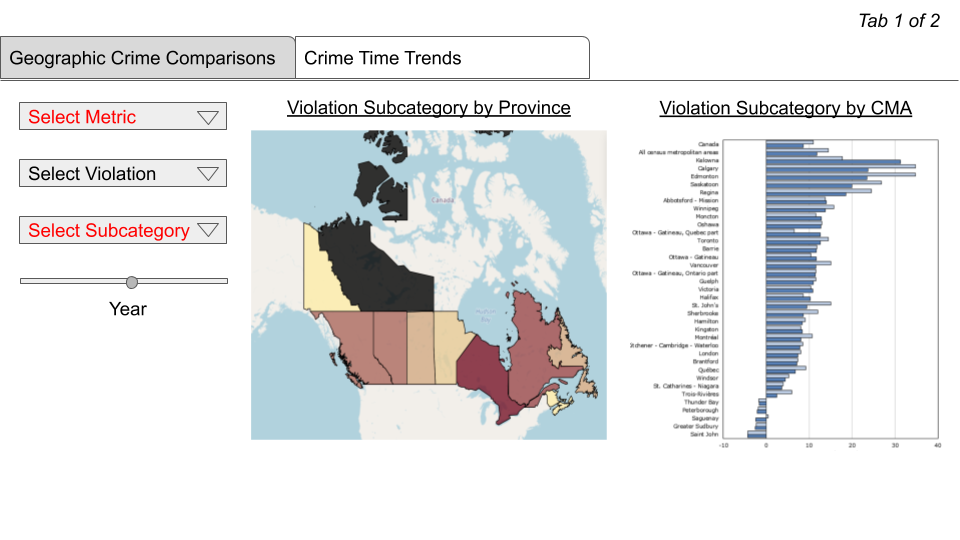

Dashboard Proposal   *Criminality in Canada: Fighting Anecdotes with
Data*
================

  - [1 Motivation and purpose](#motivation-and-purpose)
  - [2 Description of data](#description-of-data)
  - [3 Research questions and usage
    scenarios](#research-questions-and-usage-scenarios)
  - [4 Description of App and Sketch](#description-of-app-and-sketch)

# 1 Motivation and purpose

**Our Role:** Data scientists at a consultancy firm

**Target Audience:** General public

The public’s understanding of the distribution and prevalence of crime in Canada is often not based on the robust data collected by police departments around the country. Instead, people’s knowledge of crime is often derived from stories circulating through their communities or presented in the media. Both these sources of information have
significant limitations. For example, a given person will only hear about a small percentage of total crimes committed across the nation through the media or through community connections. Additionally, crimes that are violent or otherwise sensational are often overrepresented.

In order to foster an understanding of crime that is more comprehensive and less biased, our team propose to create a dashboard which allows the public to easily view and explore Canadian crime data. These data will be sourced from Statistics Canada. The dashboard will be easy to navigate for someone from the general population and provide summary information in a way that is easy to interpret. The dashboard will be interactive and allow users to explore crime types, geographic locations, and various crime metrics as well as the year in which they occurred.

# 2 Description of data

We will be visualizing a dataset which consists of approximately 50,000 observations of aggregated crime metrics. Each row indicates an annual value for a given geographic location, crime type, and crime metric. There are some missing values in this dataset, which is related to particular crime metrics only reported in recent years. The `GEO` column illustrates the province or Census Metropolitain Area (CMA) being observed, the `Violations` column describes the crime type (e.g., homicide, fraud). The `Statistics` column corresponds to the crime metric (e.g., violations per 100k, violations per 100k for those aged 12-17). The `Value` column represents the corresponding quantitative value. This dataset was compiled by the Canadian Centre for Justice Statistics (CCJS), in co-operation with the policing community, who collect and submit police-reported crime data through the Uniform Crime Reporting Survey (UCR). It was sourced from the Statistics Canada data portal, and can be found here [here](https://www150.statcan.gc.ca/t1/tbl1/en/cv.action?pid=3510017701).

# 3 Research questions and usage scenarios

**Sample usage scenario:** 
Sarah and her family, who currently live in the United States, have been considering moving to Canada on the premise of better job prospects. She is interested in purchasing a house that is in an area with a relatively low crime rate and she wants to understand how the crime rate has varied over time for different types of crime. Sarah has heard stories in the news about crime in various parts of Canada but wants to make sure she is making her decision based on reliable information. She wants to explore a dataset with the purpose of comparing the types, frequency, and the time period of crimes committed in various provinces and Census Metropolitan Areas (CMA), to be able to identify a relatively low crime environment for her move. When Sarah accesses the "Criminality in Canada: Fighting Anecdotes with Data" dashboard to \[learn\] more about violent crime rates in Canada. She will see an overview of the available variables in her dataset, which is based on the police-reported crime statistics collected through the Uniform Crime Reporting Survey. Sarah would like to live near the mountains so she \[limits\] the crime rate data she is viewing to areas in Alberta, British Columbia, Quebec, Northwest Territories, Yukon, and Nunavut. Sarah is primarily concerned with violent crimes so she \[excludes\] all other types of crime from her search. Sarah is now able to \[explore\] a map on the 'Geographic Crime Trends' tab of the dashboard which shows the relative violent crime rates in her areas of interest. Sarah chooses the 10 regions having the lowest violent crime rates and does some more research on these areas. Based on factors other than violent crime rates, she narrows her list down to 5. Sarah understands that crime rates are not static so she wants to understand whether violent crimes have been increasing or decreasing recently. Sarah opens the 'Crime Time Trends' tab of the dashboard and views a plot showing the violent crime rates over the past 5 years. Identifying the region in which the violent crime rate is decreasing the fastest, Sarah is able to decide where in Canada she and her family will settle.

# 4 Description of App and Sketch

A pdf copy of the sketch of our proposed app can be found [here](https://github.com/sbabicki/532_Group_22/blob/main/design_mockup.pdf).  

The app contains two tabs which can be selected which have different customization options. Widgets with writing in red are additional features that we would like to have, but we do not deem them essential to implement if we do not have the time or resources to complete them. 

The first tab, **Geographic Crime Comparisons**, explores various crime statistics between different provinces and between different Census Metropolitan Areas (CMAs). 
.

A choropleth map shows the colour coded gradients for the crime rate for provinces and a bar chart shows how given crime rate varies by CMAs. The user can select one of 4 violation types from a dropdown menu (e.g. "Total drug violations"). The user can also select which year to filter by using a slider. 

Additional optional features are Select Metric and Select Subcategory. Select Metric allows the user to select a different metric to display instead of the default "Rate per 100,000" (e.g. "Rate per 100,000 aged 12-17 years old"). Select Subcategory allows the user to specify a violation subcategory rather than its parent category (e.g. "Possession, Cocaine" instead of "Total drug violations").

The second tab, **Crime Time Trends**, explores trends in crime over time for selected provinces or CMAs.

Four time-series plots show the trends over time for crime rate in selected locations. The user can select to compare either CMAs or Provinces. Then, they can select multiple locations of that type from a widget which allows multiple items to be selected. A line with a different colour for each select location will appear on each plot.

An additional optional feature is Select Metric, which allows the user to select a different metric to display instead of the default "Rate per 100,000" (e.g. "Rate per 100,000 aged 12-17 years old").

# References

Statistics Canada. Table 35-10-0177-01  Incident-based crime statistics, by detailed violations, Canada, provinces, territories and Census Metropolitan Areas
